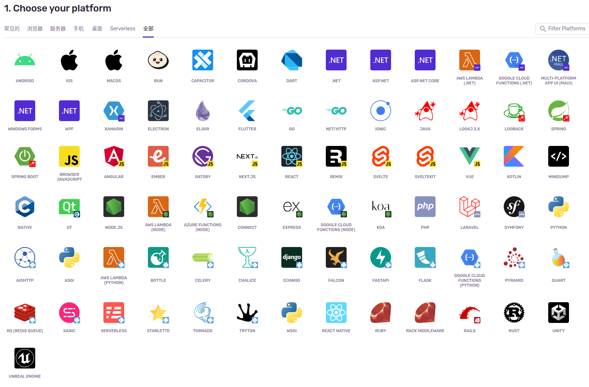
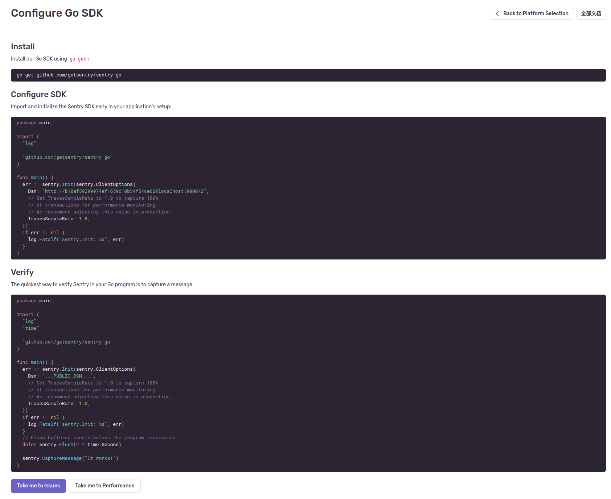
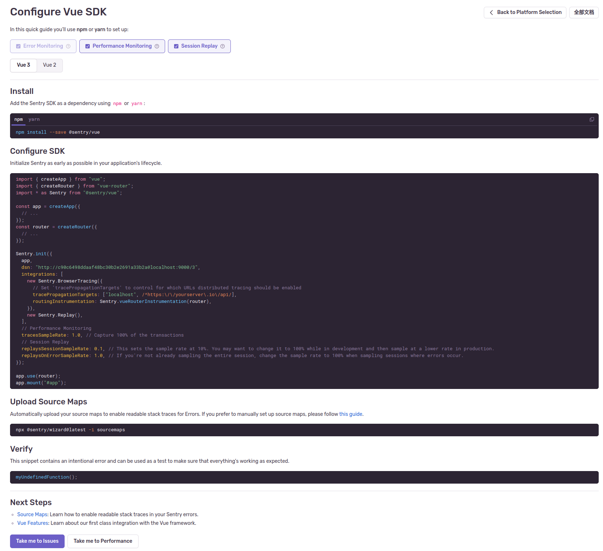
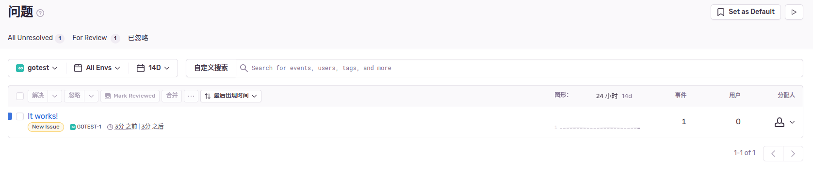
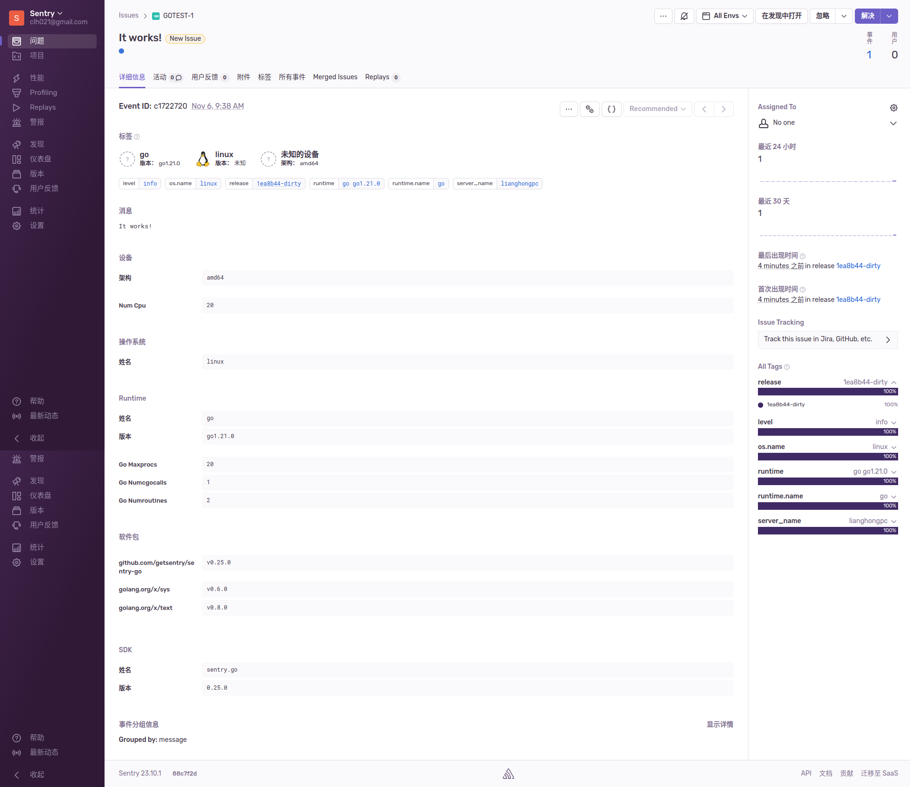
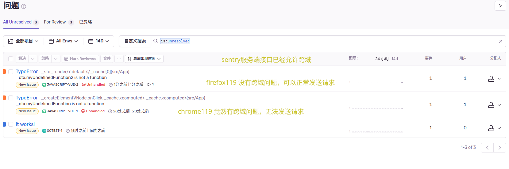
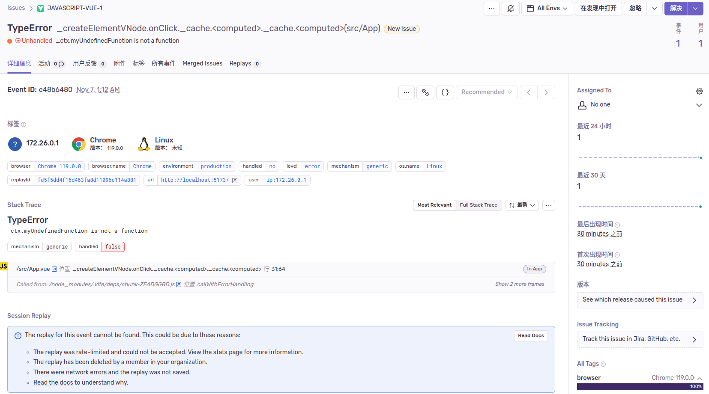
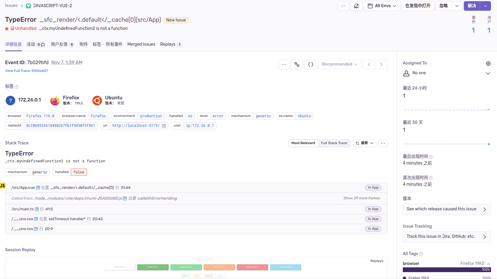

# 如何使用

## 创建项目

- 选择导航"项目" -> 右上角"创建项目"功能
- 选择您项目的平台

- 点击"创建项目"，然后立刻可以看到如何接入项目的SDK接入教程

    这是以 golang 语言项目的SDK接入教程

    

    这是以 vue 语言项目的SDK接入教程

    

### 尝试创建出一个 [golang 项目来测试](./sdk.test/go/)

  
  

### 尝试创建出一个 [vue3 项目来测试](./sdk.test/vue3/)

  

  奇怪，我的 entry 设置了允许跨域的域名。但是 `chrome v119.0.0` 仍然报告跨域问题(表格中看到的 chrome错误报告记录是我调试时使用curl测试发送成功的报告)，而 `firefox v119.0` 却可以正常发送错误报告到 entry。这可能是 `chrome v119.0.0` 的BUG

  
  

